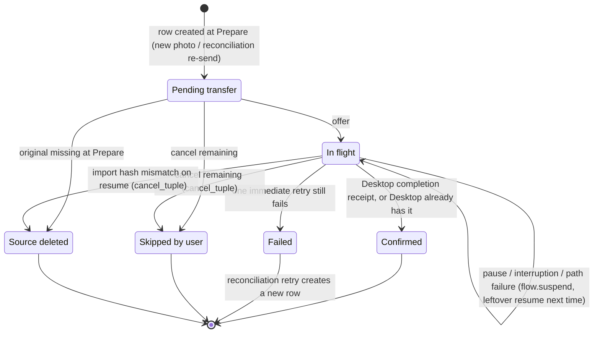
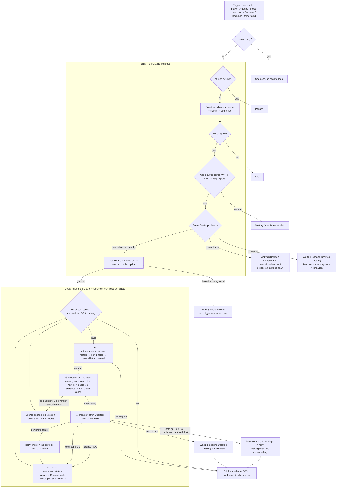
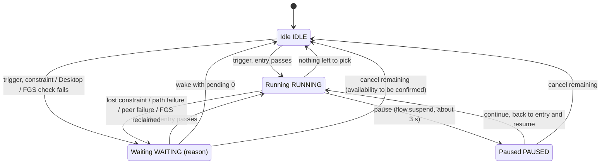

# ARCH-01 Backup Core Design Archive

> English companion · archived 2026-08-29 · aligned with the #413 final design 2026-09-24  
> Canonical task card: [`ARCH-01`](../../../cards/done/ARCH-01-backup-core-flow-queue-design.md) · Product design: [#413](https://github.com/hawkeye-xb/P-Pass/issues/413) · Chinese primary archive: [`README.zh-CN.md`](README.zh-CN.md) · Final design summary: [`final-design-413.md`](final-design-413.md) · Workstreams and interfaces: [`workstreams-contract-413.md`](workstreams-contract-413.md)

This directory archives the ARCH-01 product semantics, boundaries, and mermaid diagrams. It describes logical facts and does **not** choose a table schema, file format, Iroh FFI, or UI layout; the only storage prerequisite is that orders can be written per row and per transaction. Where this document disagrees with `final-design-413.md`, the latter wins. Implementation cards must not redefine these business rules.

## Terms and diagram index

The pipeline has exactly three activities, and these three words are used throughout:

| Activity | What it does | Where the result goes |
|---|---|---|
| Discovery | finds new photos by G; computes the pending set when counting | nothing is stored; a new photo gets its order during Prepare |
| Reconciliation | asks Desktop whether confirmed photos still exist; retries failed photos once | a new order row, picked at the last priority level |
| Transfer | the per-item loop: re-check, then four steps Pick → Prepare → Transfer → Commit | order state; G advances when a new photo commits |

The diagrams live in mermaid blocks inside this document, so text and diagrams share one source:

| Diagram | Location |
|---|---|
| Main flow (entry + four loop steps) | “Transfer” section |
| Global state machine (pause / continue / cancel) | “States and user actions” section |
| Order state machine | “Three-layer model” section |

## Test contract

- [Failure Case Matrix — Chinese](04-case-matrix.zh-CN.md)
- [Failure Case Matrix — English](04-case-matrix.md)

The matrix maps each product rule to an automated contract test, negative proof, and reviewer-operated device acceptance. Review the matrix before writing production code.

## Agreed product rules

```text
Intent (written only by user actions)
+ Facts (written only by the transfer loop and reconciliation)
→ Pending (never stored, always computed)
= UI, background wakes, triggers, and transport obey the same facts.
```

- **The pending set is not materialized.** Pending = in-scope photos − skip list − confirmed, computed on every use. The home screen “to back up” count and the entry count both read it: one source, and exact. There is no paging window and no pending snapshot.
- **Scope is only a query condition.** Changing scope writes no order state; the next query simply uses the new scope.
- **One order row per transfer.** An order records a transfer fact. A re-send never reuses the original order id (Desktop answers “done” for an id it already completed); it creates a new row.
- **“Already there” is decided by Desktop deduplicating on the content hash (BLAKE3).** The phone does no local reconciliation; when Desktop answers “already have” to an offer, the photo is done.
- **Pause is durable intent.** App death, reboot, a network change, or a background wake cannot clear it; only Continue can. The entry checks it first.
- **Waiting for constraints is not a failure.** Wi-Fi, battery, quota, or an unreachable or unhealthy Desktop: release the FGS, set the global state to waiting (the reason is persisted), and resume automatically when the constraint recovers.
- **Triggers are only signals.** They are not queued or stored; triggers arriving while the loop runs are coalesced.
- A photo is “confirmed” only after Desktop has **completely received, verified, durably saved, and explicitly acknowledged** it; a later scope change, cancellation, or phone restart cannot revoke that. When a photo is edited, the old version’s confirmation is kept.
- P-Pass is one-way backup and never deletes the phone original. When reconciliation finds a confirmed photo missing on Desktop, it is **re-sent automatically**; photos on the skip list are not re-sent.

## Three-layer model

| Layer | What it stores | Who writes it | Lifecycle |
|---|---|---|---|
| Intent | album scope, skip list, pause flag | user actions only | durable; changes only with user actions |
| Facts | orders: one row per transfer (`_id`, version, hash, state, failure count) | only the transfer loop and reconciliation | backup history of the current pairing (see “Change Desktop”) |
| Pending | nothing stored; computed = in-scope photos − skip list − confirmed | a pure function | none |

Besides intent and facts there are a few runtime facts:

| Fact | Content | Notes |
|---|---|---|
| User configuration | auto-backup switch, Wi-Fi only, battery constraint | kept after a Desktop change |
| New-photo cursor G | `GENERATION_MODIFIED` of the last committed new photo | serves new photos only; advances only when a new photo commits |
| Global state and wait reason | see “States and user actions” | the wait reason is persisted and survives a process restart |
| Pairing and transfer ownership | current Desktop, valid transfer ownership, ownership of Desktop partials | cleared on Desktop change |

### Order states

An order has exactly six states. There is **no** “paused” (pause is global), **no** “version changed”, and **no** “cancelled by scope” (scope is only a query condition).

| State | Meaning |
|---|---|
| Pending transfer | the row exists; not yet offered |
| In flight | offered; unchanged by pause, interruption, or path failure, and picked up next time as a leftover resume |
| Confirmed | Desktop fully received, verified, durably saved, and acknowledged it; or answered “already have” to the offer |
| Failed | still failed after one immediate retry; the backstop reconciliation tries once more (a new row), bounded |
| Skipped by user | pending-transfer or in-flight orders at the moment of “Cancel remaining” |
| Source deleted | the original was gone at Prepare; or an old version’s in-flight order whose import hash no longer matches on resume (the photo was edited during the interruption), in which case `cancel_tuple` also drops the Desktop partial |



### Invariants

```text
One transfer
= one row in the order table; re-sends and retries create new rows and never reuse an order id.

Commit
= new photo: the state and the advance of G happen in one write.
  existing order (leftover resume, user restore, reconciliation re-send): state only, G does not advance.
  If a crash lands after Desktop confirms but before that write, the photo goes through
  transfer once more after restart; Desktop deduplicates by hash and answers “already have”,
  so the result is idempotent.

Confirmed
= a completed fact; later control actions, scope changes, or photo edits cannot overwrite it.

Cancel remaining
= one transaction: the whole pending set goes onto the skip list + pending-transfer / in-flight
  orders become skipped by user; all of it takes effect or none of it does.
```

## Discovery

### New photos

- Query `GENERATION_MODIFIED > G LIMIT 1`, with scope and the skip list as query conditions; one photo at a time.
- G serves new photos only and advances only when a new photo commits; committing an existing order does not advance G.
- The loop fetches the next photo only after finishing the current one, so photos taken while the loop runs are picked up naturally; triggers arriving meanwhile are coalesced into the running loop.
- G is kept per volume: each external volume is queried and advanced separately (`MediaStore.getExternalVolumeNames`).

### Pending set and counting

- Pending = in-scope photos − skip list − confirmed. Metadata only; no file reads.
- The entry count is exact; the home screen “to back up” = the size of the pending set. Progress = done this round / (done this round + to back up).
- Any change while paused (scope, restoring skipped photos, new photos) only touches intent or MediaStore; after Continue the recomputed pending set reflects it.

### Pick priority

```text
① leftover resume (in-flight orders)
→ ② user restore (photos just removed from the skip list)
→ ③ new photos (by G)
→ ④ reconciliation re-send (missing on Desktop, failure retry)
```

## Reconciliation

Reconciliation only asks Desktop; the phone does no local row-by-row comparison.

1. **Missing on Desktop:** ask Desktop, page by page, whether every confirmed photo still exists. Missing ones are **re-sent automatically**: a new order row (never the original id), picked at level ④. Photos on the skip list are not re-sent.
2. **Failure retry:** a failed photo is tried once more by the backstop reconciliation (a new row, level ④), bounded.
3. **Source deleted** is not decided by reconciliation: Prepare records it on the spot when the original is gone.

## Transfer

### Entry and loop

The entry holds no FGS and reads no files; the loop holds the FGS, re-checks before each photo, then runs four steps.

```text
Trigger (new photo / network-change callback / probe due / boot / Continue / backstop / app to foreground)
→ entry: paused? → count (exact) → constraints (paired / Wi-Fi only / battery / quota)
         → probe Desktop + Desktop health → acquire FGS + wakelock + one push subscription
→ loop, per photo:
    re-check (pause / constraints / FGS / pairing)
    ① Pick: take one photo by pick priority
    ② Prepare: get the hash — existing order: read the row; new photo: computed by reference import, then create the order
    ③ Transfer: offer; Desktop deduplicates by hash; “already have” means done, otherwise Desktop fetches
    ④ Commit: new photo = state + advance G in one write; existing order = state only
→ nothing left to pick → release FGS, subscription, wakelock
```



- **FGS lifetime = loop lifetime.** It is not started and stopped per photo, and not switched with app foreground/background state.
- **One push subscription per round:** unbounded buffer, filtered by tuple.
- **Deduplication happens in the Transfer step:** hashing and Desktop dedup both run after the FGS is acquired; the entry reads no files.

### File reads

| Case | Reads of the original | Notes |
|---|---|---|
| New photo that must be sent | 2 | once for reference import (hash + outboard), once for serving. No copy is written; the separate Kotlin-side hash is removed |
| New photo Desktop already has | 1 | reference import only |
| Existing order Desktop already has | 0 | the hash comes from the order |

- Hashing and serving both stream, with constant memory.
- Reference import falls back to copying when its conditions do not hold: API 29 (`dataPath` is null), path and fd disagree, file ≤ 16 KiB, or `has()` is true. The fallback read buffer is 1 MiB.
- If the original is modified, truncated, or deleted while being served, serving aborts and reports through the existing status.

### Transfer verdicts

- `onLost` is a path failure immediately.
- Connection alive but no new file bytes for 3 consecutive minutes (iroh-blobs `Progress.end_offset` does not advance) → disconnect and classify as a path failure.
- No incoming Desktop connection for 15 seconds → ask Desktop for status first, and keep waiting if it answers active.
- **Partially transferred data:** iroh-blobs verifies chunk by chunk with bao, and resume fetches only the missing parts. If Desktop reclaims a partial, the fetch restarts from zero and is still correct.

### Interruptions and failures

| Class | Examples | Handling |
|---|---|---|
| Interruption | pause, FGS reclaimed by the system, network lost | call `flow.suspend` (Desktop keeps the grant active and protects the partial); the order stays in flight; pause → paused, otherwise → waiting |
| Path failure | `onLost`, handshake failure, no new bytes for 3 minutes, `fetch_failed` | not counted; the order stays in flight; waiting (Desktop unreachable), with a network-change callback + 3 probes 10 minutes apart (each probe is a trigger) |
| FGS denied in background | `startForegroundService` refused by the system in the background | waiting (FGS denied); the next trigger retries as usual, with no sticky block until foreground |
| Per-photo failure | this photo cannot be read, import fails, unknown error code | retry once on the spot; still failing → failed, loop continues with the next photo; the backstop reconciliation tries once more, bounded |
| Peer failure | Desktop reports `storage_full` / `library_unavailable` / `storage_failed` (the former `materialize_*` codes map to one of these three by cause) | the specific reason is shown on the phone; exit the loop, not counted; waiting (the matching Desktop reason) |
| Desktop partial | a half-sent photo that is never resumed | a Desktop active grant with no resume for more than 3 days is marked cancelled and its partial reclaimed; no orphan orders remain |

The phone no longer sends `flow.cancel` when the loop exits; dropping a partial always uses `flow.cancel_tuple`.

### Desktop health

- The probe reply carries `health`: free space, photo library writable, index store OK. An older Desktop without this field counts as healthy.
- Unhealthy → no FGS is acquired; the global state is waiting (specific reason); Desktop shows a system notification.
- Low-space warning when the photo library volume has < 5 GiB free (fixed threshold).
- Each offer carries the photo size `size_bytes`; Desktop checks free space against it and rejects on the spot when it does not fit (`storage_full`).

## States and user actions

### Global state

| State | Meaning | How it is left |
|---|---|---|
| Idle `IDLE` | pending is 0, or after cancel remaining | next trigger |
| Running `RUNNING` | the loop runs and holds the FGS | nothing left, pause, interruption, lost constraint |
| Paused `PAUSED` | pause flag written; no FGS, no keep-alive; every trigger stops at the first entry check | only the user: Continue or Cancel remaining |
| Waiting `WAITING` (reason) | constraint not met, Desktop unreachable or unhealthy, FGS denied; the reason is persisted | resumes automatically when a wake arrives and the entry passes |

Wait reasons are exactly: `NOT_PAIRED`, `DISABLED`, `WIFI`, `BATTERY`, `FGS_BLOCKED`, `DESKTOP_UNREACHABLE`, `DESKTOP_STORAGE_FULL`, `DESKTOP_LIBRARY_UNAVAILABLE`, `DESKTOP_STORAGE_ERROR`.



Continue goes back through the entry, so it can also land in waiting or idle; the diagram shows only the most common path.

### User actions

| Action | Available when | What it does |
|---|---|---|
| Pause | running only | write the pause flag → `flow.suspend` (synchronous, not cancellable, bounded at about 3 seconds) → exit the loop → release the FGS. The current order stays in flight |
| Continue | paused only | clear the pause flag → back to the entry; pick level ① resumes the paused photo |
| Cancel remaining N | paused; whether it is also available while waiting is to be confirmed | one transaction: the whole pending set goes onto the skip list and pending-transfer / in-flight orders become skipped by user → `cancel_tuple` → clear the pause flag → idle |
| Restore skipped | any time | remove from the skip list → the recomputed pending set includes them; sent at pick level ② |

- **The cancellation boundary is the moment the dialog appears.** N and the set written to the skip list both come from the pending snapshot at that moment; photos taken afterwards are not in it and are backed up as usual.
- Confirmed photos are not in the pending set, so cancellation does not affect them.
- Changing scope or restoring skipped photos while paused only changes intent; the pending set is recomputed after Continue.
- The Continue button looks only at the pause flag.

## Scope, cancellation, and pairing

### Scope

A scope change does nothing on the spot and writes no order state; the next query and count simply use the new scope.

- Confirmed photos are unaffected by scope changes.
- Whether an in-flight order whose album leaves the scope is still finished as a leftover resume is to be confirmed.
- Unsent photos of an album removed from scope simply drop out of the pending set; no state is written for them.

### Cancellation

See “User actions”. Cancellation writes only intent (the skip list) and the state of in-flight orders; it deletes no confirmed fact. Restore only removes entries from the skip list and does not touch existing orders.

### Change Desktop

```text
Keep: user configuration and album choices
Clear: Desktop partials, running transfer state, and old Desktop ownership
Result: the new Desktop starts a new backup history
```

Switching to a different Desktop clears the order table; the `pairing_epoch` column stays as a guard. Re-pairing the same Desktop (only the epoch changes) keeps the orders — content is addressed by hash, so confirmation still holds across epochs. After a clear, new order ids start above the current timestamp so they never collide with ids the old ledger already completed on Desktop. Whether the skip list survives a Desktop change is to be confirmed.

### Migration

- The final design’s batch 2 calls for “a data-preserving migration plus migration tests”.
- The workstreams contract says test devices (local Desktop, emulator, test phones) bump the schema version and rebuild, with no data migration.
- The choice between the two is to be confirmed; until then, test devices follow the workstreams contract.

## Implementation gate

Work follows the final design’s three batches. Each batch first writes failing tests (see the case matrix), then the minimal implementation:

```text
Batch 0 (independent of the model)
  suspend instead of cancel; hash / dedup moved after the FGS; one subscription per round;
  FGS denial no longer sticky; cancellation boundary; scope in the count; onLost fails immediately;
  error reclassification; peer failures; committing an existing order does not advance G (tests first)
→ Batch 1
  reference import (verify on device that the path is readable and bytes match); Desktop health and space pre-check
→ Batch 2
  three-layer model: skip list, one row per transfer, migration, priority pick, computed pending,
  global state in the UI, pause / cancel state machine
```

Device experiments: starting a dataSync FGS in the background after boot on Android 15; reference import. Benchmark: a 100 000-photo run.
