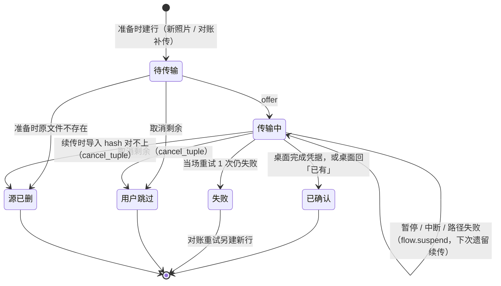
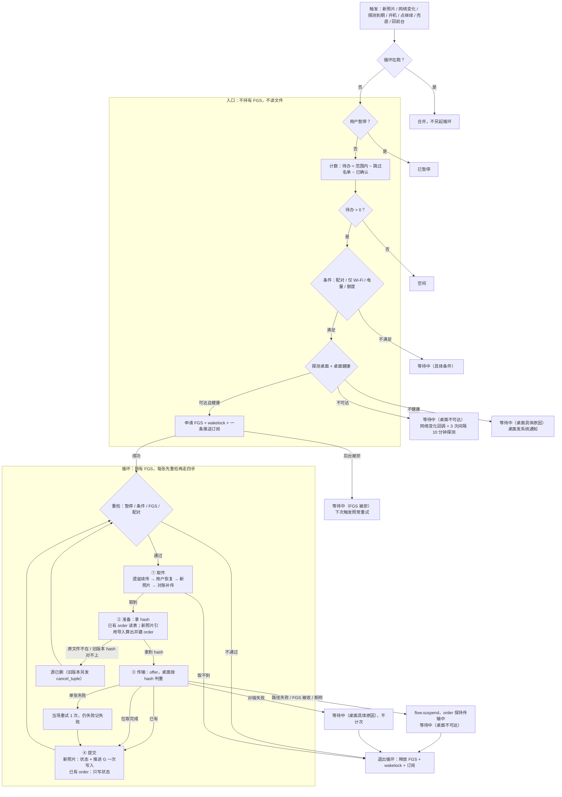
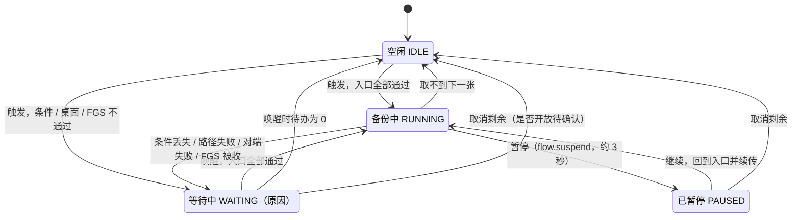

# ARCH-01 备份核心设计归档

> 中文主档 · 2026-08-29 立档 · 2026-09-24 对齐 #413 最终设计  
> 对应任务卡：[`ARCH-01`](../../../cards/done/ARCH-01-backup-core-flow-queue-design.md) · 业务设计：[#413](https://github.com/hawkeye-xb/P-Pass/issues/413) · 最终设计摘要：[`final-design-413.md`](final-design-413.md) · 分工与接口：[`workstreams-contract-413.md`](workstreams-contract-413.md)

本目录保存 ARCH-01 的业务语义、系统边界与 mermaid 图。这里描述的是逻辑事实，不规定表结构、文件格式、Iroh FFI 或 UI 细节；唯一的存储前提是 order 支持按行、按事务写入。本文与 `final-design-413.md` 不一致时以后者为准；实现卡不得改写这里的业务规则。

## 术语与图档索引

整条管道只有三个动作，全文统一用这三个词：

| 动作 | 做什么 | 结果写到哪 |
|---|---|---|
| 发现 | 按 G 找新照片；计数时现算待办 | 不写库；新照片在准备时建 order |
| 对账 | 问桌面已确认的照片是否还在；失败的照片再试一次 | 新建 order 行，排在取件最后一级 |
| 传输 | 逐张循环：每张先重检，再走四步 取件 → 准备 → 传输 → 提交 | order 状态；新照片提交时推进 G |

图直接写在本文的 mermaid 代码块里，文字与图同源：

| 图 | 位置 |
|---|---|
| 主流程（入口 + 循环四步） | 「传输」一节 |
| 全局状态机（暂停 / 继续 / 取消） | 「状态与用户操作」一节 |
| order 状态机 | 「三层模型」一节 |

## 测试合同

- [失败 Case Matrix（中文）](04-case-matrix.zh-CN.md)
- [Failure Case Matrix（English）](04-case-matrix.md)

矩阵把每条业务规则映射为自动合同测试、反证和验收人可执行的真机步骤；实现前先 review 矩阵，不先写生产代码。

## 已定业务原则

```text
意图（只有用户操作写）
+ 事实（只有传输循环与对账写）
→ 待办（不存，现算）
= 前台、后台唤醒、触发与传输都遵守同一份事实。
```

- **待办不物化。** 待办 = 范围内照片 − 跳过名单 − 已确认，每次用时现算；首页「待备份」与入口计数都读它，只有这一个来源，而且精确。没有分页窗口、没有待传快照。
- **范围只作查询条件。** 改范围不写任何 order 状态，下一次查询自然使用新范围。
- **一次传输一行 order。** order 记录的是传输事实；补传不复用原 order id（桌面对已完成的同编号直接回完成），新建一行。
- **是否已有，以桌面按内容 hash（BLAKE3）判重为准。** 手机不做本地对账；offer 时桌面回「已有」，这张就完成。
- **暂停是长期意图。** 杀 App、重启、网络恢复和后台唤醒都不能解除，只有「继续」能解除；入口第一步就查它。
- **条件等待不计失败。** Wi‑Fi、电量、额度、桌面不可达或不健康：释放 FGS，全局进入等待中（原因持久化），条件恢复时自动继续。
- **触发只是信号。** 触发不排队、不存库；循环在跑时再来的触发直接合并。
- 一张照片只有在桌面**完整接收、验证、可靠保存，并明确确认本地拥有**后才是「已确认」；之后改范围、取消或手机重启都不能否定它。照片被编辑后，旧版本的「已确认」保留。
- P-Pass 是单向备份，从不删除手机原图。对账发现桌面缺失已确认的照片时**自动补传**；在跳过名单里的照片不补传。

## 三层模型

| 层 | 存什么 | 谁写 | 生命周期 |
|---|---|---|---|
| 意图 | 相册范围、跳过名单、暂停标志 | 只有用户操作 | 长期；只随用户操作改变 |
| 事实 | order：一次传输一行（`_id`、版本、hash、状态、失败次数） | 只有传输循环与对账 | 当前配对的备份历史（见「换 Desktop」） |
| 待办 | 不存；现算 = 范围内照片 − 跳过名单 − 已确认 | 纯函数 | 无 |

意图与事实之外，还有几项运行事实：

| 事实 | 内容 | 说明 |
|---|---|---|
| 用户配置 | 自动备份开关、仅 Wi‑Fi、电量条件 | 换 Desktop 后保留 |
| 新照片游标 G | 最近一次提交的新照片的 `GENERATION_MODIFIED` | 只服务新照片，只有新照片提交时推进 |
| 全局状态与等待原因 | 见「状态与用户操作」 | 等待原因持久化，进程重启后还在 |
| 当前配对与传输归属 | 当前 Desktop、有效传输归属与桌面半截的所属关系 | 换 Desktop 时清理 |

### order 状态

order 只有六种状态。**没有**「暂停」（暂停是全局的）、**没有**「版本已变」、**没有**「因范围取消」（范围只是查询条件）。

| 状态 | 含义 |
|---|---|
| 待传输 | 已建行，还没有 offer |
| 传输中 | 已 offer；暂停、中断、路径失败时保持不变，下次按「遗留续传」接上 |
| 已确认 | 桌面已完整接收、验证、可靠保存并确认；或 offer 时桌面回「已有」 |
| 失败 | 当场重试 1 次后仍失败；兜底对账再试 1 次（新建一行），有上限 |
| 用户跳过 | 「取消剩余」时处于待传输或传输中的 order |
| 源已删 | 准备时原文件已不存在；或旧版本的「传输中」续传时导入 hash 对不上（中断期间照片被编辑），同时发 `cancel_tuple` 丢掉桌面半截 |



### 不变量

```text
一次传输
= order 表里的一行；补传、重试都新建一行，不复用原 order id。

提交
= 新照片：状态与 G 的推进在同一次写入中完成。
  已有 order（遗留续传、用户恢复、对账补传）：只写状态，不推进 G。
  崩溃若发生在桌面确认之后、这次写入之前，重启后这张再走一次传输；
  桌面按 hash 判重回「已有」，结果幂等。

已确认
= 已完成事实；后续控制操作、改范围、照片编辑都不能覆盖它。

取消剩余
= 一个事务：待办全部写进跳过名单 + 待传输 / 传输中的 order 改为用户跳过；
  要么全部生效，要么全部不生效。
```

## 发现

### 新照片

- 查询 `GENERATION_MODIFIED > G LIMIT 1`，范围与跳过名单作为查询条件；每次只取一张。
- G 只服务新照片，只有新照片提交时推进；已有 order 的提交不推进 G。
- 循环传完一张再取下一张，所以循环期间新拍的照片会被自然接上；期间再来的触发合并进当前循环。
- G 按卷分开存：每个外部卷各自查询、各自推进（`MediaStore.getExternalVolumeNames`）。

### 待办与计数

- 待办 = 范围内照片 − 跳过名单 − 已确认，只读元数据，不读文件。
- 入口的计数是精确值；首页「待备份」= 待办大小。进度 = 本轮已完成 /（本轮已完成 + 待备份）。
- 暂停期间的任何变化（改范围、恢复已跳过、新拍照片）只改意图或 MediaStore，继续之后待办现算自然反映。

### 取件优先级

```text
① 遗留续传（传输中的 order）
→ ② 用户恢复（刚从跳过名单移出的照片）
→ ③ 新照片（按 G）
→ ④ 对账补传（桌面缺失、失败重试）
```

## 对账

对账只问桌面，不做手机本地的逐行比对。

1. **桌面缺失：** 分页询问桌面，已确认的照片是否都还在。缺失的**自动补传**：新建一行 order（不复用原 order id），排在取件第 ④ 级。在跳过名单里的照片不补传。
2. **失败重试：** 「失败」的照片由兜底对账再试 1 次（新建一行，排在第 ④ 级），有上限。
3. **源已删**不在对账里判定：准备这一步发现原文件不在时当场记「源已删」。

## 传输

### 入口与循环

入口不持有 FGS、不读文件；循环持有 FGS，每张先重检，再走四步。

```text
触发（新照片 / 网络变化回调 / 探测到期 / 开机 / 点继续 / 兜底 / 回前台）
→ 入口：用户暂停？ → 计数（精确） → 条件（配对 / 仅 Wi‑Fi / 电量 / 额度）
        → 探测桌面 + 桌面健康 → 申请 FGS + wakelock + 一条推送订阅
→ 循环每张：
    重检（暂停 / 条件 / FGS / 配对）
    ① 取件：按取件优先级取一张
    ② 准备：拿 hash —— 已有 order 读表；新照片由引用导入算出，建 order
    ③ 传输：offer，桌面按 hash 判重；「已有」即完成，否则桌面拉取
    ④ 提交：新照片 = 状态 + 推进 G 一次写入；已有 order 只写状态
→ 取不到下一张 → 释放 FGS、订阅、wakelock
```



- **FGS 的生命周期 = 循环的生命周期。** 不按单张启停，也不按 App 前后台切换。
- **每轮一条推送订阅**：无界缓冲，按 tuple 过滤。
- **判重在传输这一步**：hash 与桌面判重都放在申请 FGS 之后，入口不读文件。

### 读文件次数

| 情况 | 读原图次数 | 说明 |
|---|---|---|
| 新照片，需要传输 | 2 | 引用导入算 hash + outboard 一次；供数一次。不写副本，删掉 Kotlin 侧单独算 hash |
| 新照片，桌面已有 | 1 | 只有引用导入 |
| 已有 order，桌面已有 | 0 | hash 从 order 读 |

- 算 hash、供数都流式，内存恒定。
- 引用导入不满足条件时回退复制：API 29（`dataPath` 为空）、路径与 fd 不一致、文件 ≤ 16 KiB、`has()` 为 true。回退读缓冲 1 MiB。
- 原文件在供数过程中被改、截断或删除：供数中止，通过现有状态回报。

### 传输判定

- `onLost` 立即判路径失败。
- 连接还在、但连着 3 分钟没有新的文件字节（iroh-blobs `Progress.end_offset` 不前进）→ 主动断开，判路径失败。
- 15 秒没有桌面来连 → 先问桌面状态，回答 active 就继续等。
- **传了一半的数据：** iroh-blobs 按块用 bao 边收边验证，续传只补缺失部分。桌面把半截回收了就从头再拉，结果依然正确。

### 中断与失败

| 类别 | 例子 | 处理 |
|---|---|---|
| 中断 | 暂停、FGS 被系统收回、断网 | 调 `flow.suspend`（桌面保持 grant active、半截受保护）；order 保持传输中；暂停 → 已暂停，其余 → 等待中 |
| 路径失败 | `onLost`、握手失败、3 分钟无新字节、`fetch_failed` | 不计次；order 保持传输中；等待中（桌面不可达），挂网络变化回调 + 3 次间隔 10 分钟的探测（每次探测就是一次触发） |
| 后台 FGS 被拒 | 后台申请 `startForegroundService` 被系统拒绝 | 等待中（FGS 被拒）；下次触发照常重试，不持久卡死到回前台 |
| 单张失败 | 这一张读不出来、导入出错、未知错误 code | 当场重试 1 次，仍失败记「失败」，循环继续下一张；兜底对账再试 1 次，有上限 |
| 对端失败 | 桌面回报 `storage_full` / `library_unavailable` / `storage_failed`（原 `materialize_*` 按原因归入这三类） | 带具体原因回手机显示；退出循环，不计次；等待中（对应的桌面原因） |
| 桌面半截 | 传了一半后再没续传 | 桌面 active grant 超过 3 天未续传 → 标记取消并回收半截；不残留垃圾 order |

手机不再在循环退出时发 `flow.cancel`；丢弃半截一律用 `flow.cancel_tuple`。

### 桌面健康

- 探测回复带 `health`：剩余空间、照片库可写、索引库正常。旧桌面没有这个字段时视为健康。
- 不健康 → 不申请 FGS；全局等待中（具体原因）；桌面发系统通知。
- 照片库所在卷剩余空间 < 5 GiB 预警（固定阈值）。
- offer 时带单张大小 `size_bytes`，桌面按它预检剩余空间，放不下当场拒绝（`storage_full`）。

## 状态与用户操作

### 全局状态

| 状态 | 含义 | 谁能离开 |
|---|---|---|
| 空闲 `IDLE` | 待办为 0，或取消剩余之后 | 下一次触发 |
| 备份中 `RUNNING` | 循环在跑，持有 FGS | 取不到下一张、暂停、中断、条件丢失 |
| 已暂停 `PAUSED` | 暂停标志已写；不持有 FGS，不做保活；任何触发在入口第一步就停 | 只有用户：继续 或 取消剩余 |
| 等待中 `WAITING`（原因） | 条件不满足、桌面不可达或不健康、FGS 被拒；原因持久化 | 唤醒到来、入口全部通过后自动继续 |

等待原因只有这些：`NOT_PAIRED`、`DISABLED`、`WIFI`、`BATTERY`、`FGS_BLOCKED`、`DESKTOP_UNREACHABLE`、`DESKTOP_STORAGE_FULL`、`DESKTOP_LIBRARY_UNAVAILABLE`、`DESKTOP_STORAGE_ERROR`。



「继续」回到入口重新判定，所以继续之后也可能直接落到等待中或空闲；图里只画了最常见的一条。

### 用户操作

| 操作 | 何时可用 | 做什么 |
|---|---|---|
| 暂停 | 只在备份中 | 写暂停标志 → `flow.suspend`（同步、不可取消、限时约 3 秒）→ 退出循环 → 释放 FGS。当前 order 保持传输中 |
| 继续 | 只在已暂停 | 清除暂停标志 → 回到入口；取件第 ① 级续传被暂停的那张 |
| 取消剩余 N 张 | 已暂停；等待中是否可用待确认 | 一个事务：把当前待办全部写进跳过名单、待传输 / 传输中的 order 改用户跳过 → `cancel_tuple` → 清除暂停标志 → 空闲 |
| 恢复已跳过 | 任何时候 | 从跳过名单移除 → 待办现算自然包含，按取件第 ② 级传 |

- **取消的边界 = 弹窗显示那一刻。** N 与写进跳过名单的集合都取自那一刻的待办快照；之后新拍的照片不在其中，照常备份。
- 已确认的照片不在待办里，取消不影响它们。
- 暂停中改范围、恢复已跳过，都只改意图；继续后待办现算。
- 「继续」按钮只看暂停标志。

## 范围、取消与配对

### 修改范围

改范围当场不做任何处理，不写任何 order 状态；下一次查询和计数自然使用新范围。

- 已确认的照片不受改范围影响。
- 已经在传输中的 order 所在相册被移出范围后，是否仍按「遗留续传」传完，待确认。
- 相册移出范围后，其中未传的照片不再出现在待办里，不需要为它们写任何状态。

### 取消

见「用户操作」。取消只写意图（跳过名单）和在途 order 的状态，不删除任何已确认事实；恢复只从跳过名单移除，不改已有 order。

### 换 Desktop

```text
保留：用户配置与相册选择
清理：桌面半截、运行中传输与旧 Desktop 归属
结果：新 Desktop 从新的备份历史开始
```

换一台 Desktop 时清空 order 表；`pairing_epoch` 列保留作防护。同一台 Desktop 重新配对（只换了代号）时 order 保留——内容寻址，已确认跨代号依然成立。清空时新 order id 的起点抬到当前时间戳之上，避免与 Desktop 上旧账本已完成的编号相撞。跳过名单在换 Desktop 时是否保留，待确认。

### 迁移

- 最终设计第 2 批要求「带数据保留的迁移 + 迁移测试」。
- 分工契约规定测试设备（本地桌面、模拟器、测试真机）上直接升 schema 版本重建，不写数据迁移。
- 两者的取舍待确认；确认前，测试设备按分工契约执行。

## 开发前门禁

按最终设计分三批，每批先写失败测试（见 case matrix），再写最小实现：

```text
第 0 批（与模型无关）
  suspend 替代 cancel；hash / 判重挪到 FGS 之后；每轮一条订阅；FGS 被拒不卡死；
  取消边界；计数加范围；onLost 立即判定；错误重新分类；对端失败；
  已有 order 提交不推进 G（先补测试）
→ 第 1 批
  引用导入（真机验证路径可读、字节一致）；桌面健康与空间预检
→ 第 2 批
  三层模型：跳过名单、一次传输一行、迁移、按优先级取件、现算待办、
  UI 全局状态、暂停 / 取消状态机
```

真机实验：Android 15 开机后台启动 dataSync FGS；引用导入。基准：10 万张实测。
