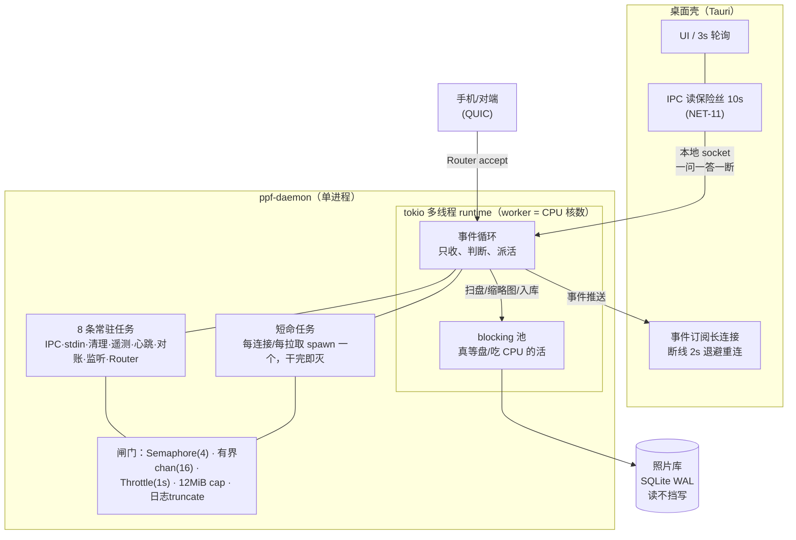
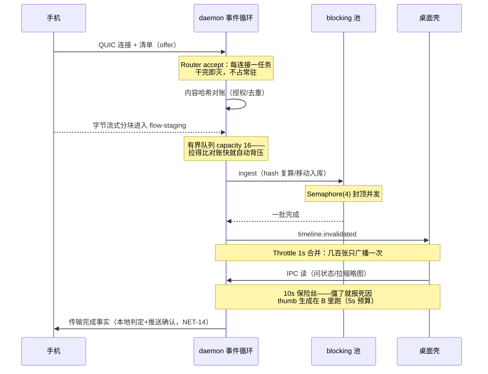

# 后台任务运行模型（daemon runtime model）

> 用途：一页讲清 `ppf-daemon` **怎么跑任务**，以及「会不会经常卡住」「会不会吃掉电脑」
> 这两个问题各自的答案在哪。所有结论带源码出处（`crates/daemon/src/`，行号截至 2026-09-18）。
> 中文优先的内部工程记录。不含 UI 层，不含移动端。

## 0. 一句话结论

单进程 + 单异步运行时。常驻循环只有 8 条，其余全是「来活才存在」的短任务。
**闲时≈0 开销，忙时被并发闸门封顶**；防卡的四道防线里三道已落地，
第四道（跨网络等待全部死线化）是明确挂号的欠账，见 §6。

## 1. 进程与线程形状

`#[tokio::main]`（`main.rs:8`）。两种线程的分工是全仓纪律：

| 活 | 跑在哪 | 为什么 |
|---|---|---|
| 收连接、读 socket、查索引、发事件 | 事件循环 worker | 快、可并发、绝不独占线程 |
| 扫盘 walk、批量 stat、缩略图解码/生成、大文件入库、读 stdin | blocking 池 | 会真等盘/CPU，压在事件循环上会拖死全引擎 |

前科：DESK-13（大文件 ingest 同步阻塞 worker → 桌面 UI 冻结）。修完后这条成了默认写法，
现存下放点 `query.rs:119`（缩略图生成）、`watcher.rs:184/301`（扫盘/批量 stat）、
`main.rs:273`（读 stdin）。

## 2. 八条常驻任务（全名单，一条不漏）

| # | 任务 | 出处 | 触发 | 闲时开销 |
|---|---|---|---|---|
| 1 | IPC 服务（桌面壳/testclient 询问） | `main.rs:255` → `ipc.serve` | 常驻 accept | 挂在 await，0 |
| 2 | stdin 控制台确认器（配对 y/n） | `main.rs:268` | 常驻读行 | 挂在 blocking 池读，0；EOF 即退出 |
| 3 | 诊断环清理 | `main.rs:299` | 每 6h | 一次 DB prune |
| 4 | 遥测攒批 flush | `main.rs:317` | 每 300s | 开关关闭时**整条任务不启动**（opt-out 在根上） |
| 5 | 心跳记录 DaemonAlive | `main.rs:320` | 每 24h | 写内存缓冲，随 #4 一起 flush |
| 6 | 索引对账 Reconcile | `main.rs:461` | 启动一次 + 每 1h | 一次增量扫描（下放 blocking） |
| 7 | 库目录监听 LibraryWatcher | `watcher.spawn()` | notify 事件驱动 + 防抖 | 挂在通道，0 |
| 8 | Router（对端 QUIC：传输/订阅/配对） | `main.rs:538/552` | 常驻 accept（主循环本体） | 挂在 await，0 |

#7 启动失败时**降级而非崩溃**：改由 #6 每小时对账兜底（`main.rs:514` warn）。

每条都是「循环 + sleep 到点」或「挂在通道/accept 上等」——没有忙轮询，没有定时器猜状态。

## 3. 短命任务：来一个活 spawn 一个

事件驱动的另一半：所有按请求存在的工作单元，干完即灭，不养闲线程。

- **IPC**：每连接 `tokio::spawn` 独立任务（`ipc.rs:402-411`）
- **Router**：每连接一个 QUIC 会话任务
- **Flow**：每次拉取 `spawn_fetch_task` + CancellationToken 注册表
  （`flow_delivery.rs:651`——暂停/取消能打到飞行中的传输）

一次「手机给桌面传照片」的完整生命周期（图里三层防线各管一段）：

## 4. 资源闸门（防「吃掉电脑」的具体数字）

| 闸门 | 值 | 出处 | 治什么 |
|---|---|---|---|
| ingest 并发 | `Semaphore(4)` | `watcher.rs:237` | 一次导入几万张时把磁盘/CPU 顶满 |
| 内部队列 | 有界 channel `capacity 16` | `iroh_impl.rs:473` | 生产快于消费时无界堆内存；满了自动背压 |
| 事件合并 | `Throttle` 1s 窗口 | `events.rs:54` | 一批几百张备份只广播一次 `timeline.invalidated`，不刷屏 |
| 原图帧上限 | `ORIGINAL_CAP 12MiB` | `query.rs:179` | 查看大图时一次读爆内存 |
| 日志体积 | 超限就地 truncate | `log_guard.rs:42` | 真实事故：握手失败 7 分钟刷 92211 行 / 73MB |
| 扫描节流 | notify 防抖（Reset 窗口）+ 父路径合并 | `watcher.rs` 模块注释 | 相册批量写入时反复全量扫盘 |

内存形状上没有「整库进内存」的结构：索引走 SQLite 分页查询，缩略图按需生成 + 落盘缓存，
大文件走 iroh 流式分块。（iroh 库内部的缓冲策略未拆读——本文只担保我们这侧是流式管道。）

磁盘卫生：构建/临时产物走 `just cleanup-local`；启动时清空 `.ppf/blobs` 收件箱（BLOB-01）；
flow-staging 孤儿由 #6 每小时回收。

## 5. 等待必须带死线（防「卡住」的最后一道）

| 等待点 | 死线 | 出处 |
|---|---|---|
| daemon 探活对端 | 800ms | `ipc.rs:105` `peer_call` |
| 桌面壳 → daemon 的每次 IPC 读 | **10s**（NET-11） | `apps/desktop/src-tauri/src/ipc.rs` `IPC_READ_TIMEOUT` |
| 壳重启 daemon 后等就绪 | 12s | `lib.rs:439` |
| 遥测 flush 一次上报 | 20s | `telemetry.rs:34` |
| 事件订阅断线重连 | 2s 退避 | `lib.rs:81` `start_event_stream` |
| ephemeral 退出协议关闭 | 2s，超时强退 | `main.rs` UX-07 |

配套纪律：**错误串必须带方法名**（超时不能只是"失败了"，要说"哪个卡住了"）。

## 6. 已知欠账（诚实清单，都在 GitHub Issues 挂号）

防线里最薄的一层是「跨网络长任务仍有同步等形状」——不是没发现的洞，是排了队的债：

- **#132 NET-06**：Flow 交付异步化（202 受理即回 + 轮询）——这批病的总根治，已拆子卡
- **#116 NET-09**：长数据面「字节停滞」看门狗
- **#128 NET-10**：配对拆「提交 ≠ 等人」
- **#120 NET-07**：超时按调用类型分档（过渡止血）
- **#134 NET-08**：全仓「同步等长任务」焊点普查（已完成，产出的就是上面这几张）

## 7. 两个问题的答案

**会不会经常卡住？**
运行模型本身不制造卡死（事件驱动 + 快慢分流 + 有界队列 + 短锁）。已知卡死来源只有两类：
① 某段同步活霸占事件循环——DESK-13 那类，纪律是下放 blocking，且刚合的 NET-11 给壳装了保险丝，
最坏情况从「整壳冻结无死因」变成「一条超时 + 失联横幅」；
② 跨网络等待无死线——§6 那串卡在还。
SQLite 用 WAL，读不挡写（`db.rs:26` 注释原话），锁都是表级短临界区，不存在长持锁。

**会不会占用电脑非常多的资源？**
闲时被架构封顶在≈0（全部挂在 await）；忙时被 §4 那六个数字封顶，且都是显式常量不是"感觉差不多"。
唯一会持续写盘的是日志与索引，两者都有上限/回收路径。

## 8. 新增后台任务时的检查表

- [ ] 会等磁盘/CPU 吗？会 → `spawn_blocking`，别放事件循环
- [ ] 有并发上限吗？没有 → 加 `Semaphore` 或有界 channel
- [ ] 有等待吗？有 → 必须有死线 + 错误串带标识
- [ ] 事件会爆发吗？会 → 走 `Throttle` 合并窗
- [ ] 常驻还是短命？常驻 → 更新本文 §2 的名单
